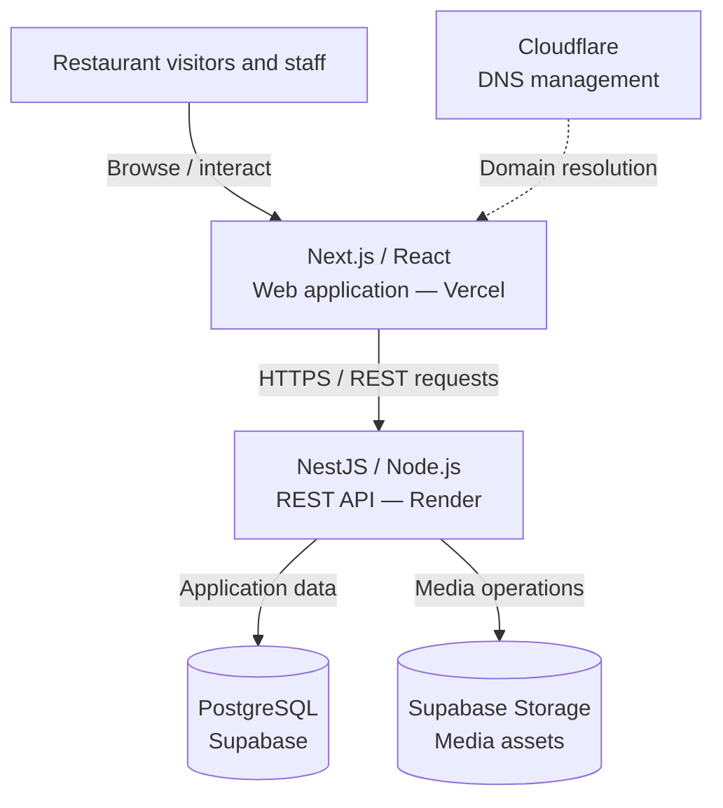

# System Architecture

**Project:** La Cantina de Sabina — Restaurant Web Platform  
**Context:** Collaborative, production-deployed project developed within Saav Studio  
**Documentation scope:** Public, high-level architecture overview

> This document describes the system at a conceptual level based on the project's documented technologies and delivered features. It is **not** an infrastructure inventory, an audited security design, or a reproduction of private source code.

## 1. Architectural Overview

The platform separates the public-facing web experience from backend business logic and persistence:

- **Frontend:** Next.js with React and TypeScript, hosted on Vercel.
- **Backend:** NestJS running on Node.js, hosted on Render and exposing REST APIs.
- **Data layer:** PostgreSQL provided through Supabase.
- **Media storage:** Supabase Storage for managed content assets.
- **Domain configuration:** Cloudflare for DNS management.

Customers use the public website to explore restaurant information and submit reservations. Authorized administrators use protected interfaces to manage reservations and restaurant content.

## 2. High-Level Component Diagram

**Reading the diagram:** It illustrates logical responsibilities and integrations, not private hostnames, network segments, service credentials, or every possible file-delivery path. Cloudflare is shown for DNS management, not as a claim about traffic proxying.

## 3. Component Responsibilities

### Frontend — Next.js, React, TypeScript, Tailwind CSS

The web application provides:

- Responsive restaurant pages and navigation.
- Public restaurant information, menu and events views.
- The customer-facing reservation interface.
- Administrative screens for supported management tasks.
- Requests to the backend REST API.

Next.js handles the web application layer; business rules and data persistence are kept on the backend rather than being treated as frontend-only responsibilities.

### Backend — NestJS, Node.js, REST APIs

The backend is responsible for application operations, including:

- Processing reservation-related requests.
- Supporting menu and event management functionality.
- Validating incoming data.
- Applying administrative authentication and protected access where required.
- Coordinating persistence and media operations.

NestJS provides a modular structure for separating request handling from application logic. This public document intentionally omits internal endpoint paths and code-level implementation details.

### Persistence — PostgreSQL / Supabase

The relational database supports the application's persistent operational data, such as restaurant content and reservation information.

Supabase also provides managed storage used for content assets. The precise table schema, storage policies, database credentials, and private access configuration are intentionally not published.

## 4. Main Application Flows

### Customer reservation

1. A visitor opens the responsive website.
2. The visitor provides the required reservation information.
3. The frontend sends the request to the backend API.
4. The backend validates and processes the request and persists the relevant information.
5. Restaurant administrators can review or manage reservation records through the administrative interface.

This describes the shared flow. It does not claim that every reservation is automatically confirmed or specify unverified capacity-management rules.

### Administrative management

1. An administrator accesses the administrative web interface.
2. The application uses an authentication flow based on JWT.
3. Protected backend functionality handles authorized management actions.
4. Changes to reservation, menu or event information are persisted and made available to the appropriate interfaces.

The diagram does not disclose token storage mechanisms, signing secrets, account details, or private endpoints.

### Restaurant content

Menu and event information is managed through the application's administrative capabilities and displayed by the customer-facing experience. Content assets can be handled through the integrated storage service.

## 5. Deployment and Delivery

| Responsibility | Service |
| --- | --- |
| Web application hosting | Vercel |
| API hosting | Render |
| Managed PostgreSQL | Supabase |
| Media asset storage | Supabase Storage |
| DNS management | Cloudflare |
| Source collaboration and review | Git / GitHub |

Frontend and backend deployments are managed as distinct services. This creates a clear deployment boundary but requires coordination of releases and environment configuration.

The development process uses feature branches, pull requests, build validation, and backend tests before changes are integrated into the shared codebase.

## 6. Security and Privacy Boundaries

Security considerations represented in the project include:

- JWT-based administrative authentication and protected functionality.
- Input validation on backend requests.
- Separation of frontend presentation and backend business operations.
- Production configuration through environment variables instead of public documentation.
- Controlled handling of reservation information, which can include personal contact details.

These are design and implementation areas, **not a claim of a completed security audit or penetration test**. Authorization coverage, token lifecycle, database policies, and other lower-level controls should be evaluated against the private implementation when needed.

No production secrets, database connection strings, internal service URLs, private API routes, or customer records belong in this repository.

## 7. Architecture Decisions and Trade-offs

| Decision | Benefit | Trade-off |
| --- | --- | --- |
| Next.js frontend with NestJS REST API | Clear separation of UI and backend responsibilities | Two services and an API contract must be maintained |
| PostgreSQL with Supabase | Relational data storage with managed infrastructure | Dependence on provider configuration and service availability |
| Supabase Storage for assets | Managed storage instead of building a custom media service | Access policies and asset lifecycle require care |
| Vercel + Render hosting | Straightforward managed deployments for each application layer | Cross-service configuration, monitoring, and deployment coordination |
| Feature branches and pull requests | Incremental, reviewable development | Additional integration and release discipline |

These choices fit a small restaurant platform: they support maintainability without requiring custom servers or a microservices architecture.

## 8. Quality and Maintainability

Engineering activities during the project included:

- Backend automated tests with Jest.
- Frontend and backend production build checks.
- Responsive interface and cross-device issue resolution.
- Performance reviews with Google PageSpeed Insights.
- Documentation of development phases and implementation decisions.

Automated test counts and performance improvements are intentionally omitted because this document does not establish a current, independently verified measurement.

## 9. Scope of This Public Case Study

This document is intended to communicate software architecture and engineering decisions to recruiters, collaborators, and other developers. It **does not** grant access to the private production repository.

Not included: source code, private schemas, credential management details, internal endpoints, deployment dashboards, private operational procedures, and user data.

For the project summary, see the [main README](../README.md).
