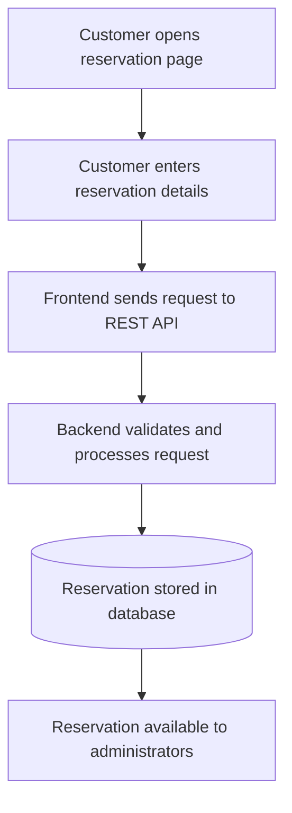

# Platform Features

**Project:** La Cantina de Sabina — Restaurant Web Platform  
**Type:** Real-world, collaborative full-stack project developed within Saav Studio  
**Audience:** Recruiters, developers, and other readers of this public case study

> **Scope note:** This document summarizes features supported by the team's project history and public case-study documentation. It is not a live feature audit of the private production repository. Where a behavior was an original requirement or a future improvement rather than a verified delivery, it is explicitly distinguished below.

## 1. Product Overview

La Cantina de Sabina is a restaurant in Heredia, Costa Rica. Its website combines a public-facing experience with operational tools for restaurant staff.

**Business context:** Before the platform, reservations were primarily received through social media messages and phone calls. The project aimed to provide a structured online reservation process and manageable digital content.

**User groups:**
- **Visitors and customers:** Browse restaurant information, view menu and event content, and submit reservations.
- **Restaurant administrators:** Sign in to protected interfaces and manage reservation requests and published content.

## 2. Customer-Facing Website

**Documented functionality**
- Responsive pages designed for mobile and desktop browsers.
- Restaurant introduction and key visitor information.
- Navigation between relevant public sections.
- Menu content presented through the public website.
- Events content and restaurant location information.
- Access to the online reservation interface.

**Engineering considerations**
- Next.js, React, TypeScript and Tailwind CSS support component-based interface development.
- Public content and application actions are integrated with the backend where applicable.
- Responsive behavior, navigation issues and performance were reviewed during development.

**Value:** Makes key restaurant information and actions accessible through a single web experience rather than relying exclusively on messaging channels.

## 3. Online Reservations

**Documented functionality**
- A customer-facing reservation form.
- Submission of reservation information to the application's backend.
- Server-side processing and persistence of reservation records.
- An administrative interface for viewing and managing reservations.

### Conceptual reservation workflow

This diagram is deliberately simplified. It **does not** imply that every request is automatically confirmed, that availability is guaranteed, or that any particular notification is sent.

**Original business requirements**
- Capture essential information needed for a reservation, including contact details, party size, and seating preference.
- Support restaurant staff in handling requests that need review.
- Consider capacity and approval behavior when automatic confirmation is not appropriate.

The exact capacity-checking and approval rules require verification against the private implementation before they can be documented as completed behavior.

**Value:** Provides a structured path for customers to submit requests and for staff to manage them.

## 4. Administrative Dashboard

**Documented functionality**
- A dedicated administrative area.
- Authenticated administrative access.
- Reservation management interfaces.
- Menu management interfaces.
- Event management interfaces.
- Support for operational reservation entry as part of the administrative workflow.

**Engineering considerations**
- Administrative actions interact with backend services rather than relying only on browser-side data.
- The public site and the protected management area serve distinct audiences.
- UI integration and functional issues were addressed iteratively during the project.

**Value:** Gives restaurant staff a central place to manage website-related operations and content.

## 5. Menu Management

**Documented functionality**
- Public menu presentation.
- Administrative interface for editing menu-related content.
- Integration between the customer-facing menu and backend-managed information.

**Value:** Reduces the need to change source code whenever menu information needs an operational update.

The public case study does not publish menu database schemas, internal API paths, or the restaurant's private operational data.

## 6. Events Management

**Documented functionality**
- Public-facing event information.
- Administrative functionality for managing events.
- Integration of event content into the restaurant website.

**Value:** Allows the restaurant to communicate event information through its own web presence.

Specific event publishing rules and content schemas are not reproduced in this public documentation.

## 7. Authentication and Protected Features

**Documented functionality**
- Administrative login.
- JWT-based authentication.
- Protected administrative interfaces and backend functionality.

**Design intent**
- Separate public customer capabilities from staff-only management operations.
- Require appropriate access for administrative actions.
- Process user-submitted inputs through backend validation.

**Important:** This is a description of the documented security features, not an independent security audit. Details such as signing keys, token lifecycle, credential storage, authorization policies, and internal routes are intentionally excluded.

## 8. Content Assets and Persistence

**Documented integrations**
- PostgreSQL through Supabase for application data.
- Supabase Storage for media assets.
- REST communication between the web interface and NestJS backend.

**Value:** Keeps content and reservation data independent from individual web pages and supports ongoing content management.

This document makes no claims about storage capacity, database row-level security configuration, or internal tables.

## 9. Production Delivery and Quality

The following are project engineering activities rather than end-user product features:

- Frontend deployment to Vercel and backend deployment to Render.
- DNS configuration through Cloudflare.
- Feature-branch and pull-request workflow on GitHub.
- Backend automated tests using Jest.
- Frontend and backend production build checks.
- Responsive UI fixes and PageSpeed Insights performance reviews.

No performance improvements, user counts, uptime percentages, or business outcomes are claimed without measured evidence.

## 10. Current Capabilities vs. Potential Extensions

| Area | How it is represented in this case study |
| --- | --- |
| Public website, menu and events | Documented project functionality |
| Online reservation submission and administrative management | Documented project functionality |
| Admin login and protected interfaces | Documented project functionality |
| Deployment and quality checks | Documented engineering work |
| Automatic confirmation under specific capacity rules | Original requirement; exact delivered rules not independently verified |
| Automated WhatsApp or email confirmations/reminders | Potential follow-up integration; **not claimed as implemented** |
| Search ranking, traffic growth, or increased bookings | Business goals; **no measured results claimed** |

Separating delivered work from proposals keeps this portfolio credible and avoids suggesting that a planned automation already exists.

## 11. Public Documentation Boundaries

This repository does **not** include:

- Production source code or complete internal API definitions.
- Credentials, environment variables, database URLs or authentication secrets.
- Real customer contact information or reservation records.
- Private administrator screenshots, unapproved media, or confidential operational details.

This case study describes **team-level work by Daniel and Javier** within Saav Studio. It is not a claim that a single contributor developed every feature independently.

See also: [System Architecture](architecture.md) · [Project README](../README.md).
